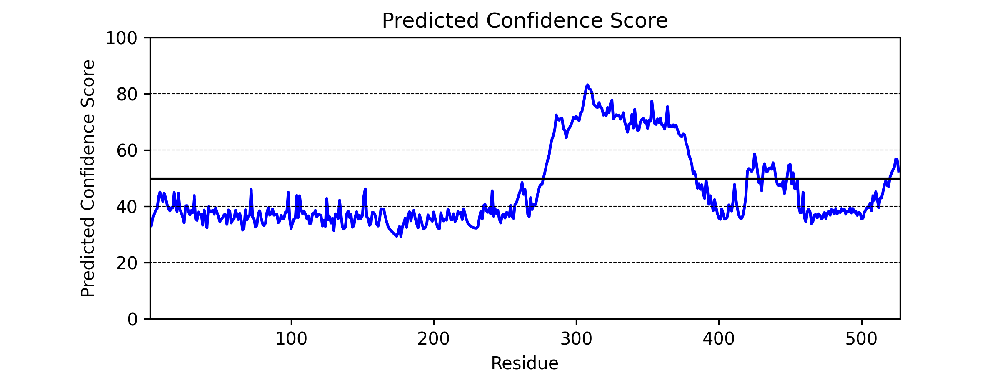

# alphaPredict: A predictor of AlphaFold2 confidence scores

**alphaPredict** uses a bidirectional recurrent neural network (BRNN) trained on the per residue pLDDT (predicted IDDT-Ca) confidence scores generated by AlphaFold2 (AF2). The confidence scores from 9 proteomes (151,970 total proteins) were used to train the BRNN behind alphaPredict. These confidence scores measure the local confidence that AlphaFold2 has in its predicted structure. The scores go from 0-100 where 0 represents low confidence and 100 represents high confidence. For more information, please see: *Highly accurate protein structure prediction with AlphaFold* https://doi.org/10.1038/s41586-021-03819-2. In describing these scores, the team states that regionds with pLDDT scores of less than 50 should not be interpreted except as *possible* disordered regions.

## Which proteomes were used to generate the network used by alphaPredict?

The confidence scores from the proteomes of *Rattus norvegicus*, *Danio rerio*, *Dictyostelium discoideum*, *Drosophila melanogaster*, *Mus musculus*, *Saccharomyces cerevisiae*, *Arabidopsis thaliana*, *Homo sapiens*, and *Escherichia coli* were used to generate the BRNN.

## Why is alphaPredict useful? 

**alphaPredict** allows for rapid generation of predicted AF2 residue-by-residue confidence scores of any protein of interest. This can be used for many applications such as generating a quick preview of which regions of your protein of interest AF2 might be able to predict with high confidence, or which regions of your protein *might* be disordered. AF2 is not (strictly speaking) a disorder predictor, and the confidence scores are not directly representative of protein disorder. Therefore, any conclusions drawn with regards to disorder from predicted AF2 confidence scores should be interpreted with care, but they may be able to provide an additional metric to assess the likelihood that any given protein region may be disordered.

## How accurate is alphaPredict?

The current BRNN has on average a ~9% error per residue. We are working on a V3 and V4 of the network that should reduce this error, but the training is going to take a few weeks for V3 and around a month for V4. 

## Installation:

**alphaPredict** is available through PyPI - to install simply run

    $ pip install alphaPredict

Alternatively, you can get **alphaPredict** directly from GitHub. 

To clone the GitHub repository and gain the ability to modify a local copy of the code, run

    $ git clone https://github.com/ryanemenecker/alphaPredict.git
    $ cd alphapredict
    $ pip install .

This will install **alphapredict** locally.

## Usage:

**alphaPredict** is usable from Python.

## Using alphaPredict from Python

First import alphaPredict - 
 
    import alphaPredict as alpha

Once imported, you can begin to generate predicted confidence scores.

### Predicting Confidence Scores

The ``alpha.predict()`` function will return a list of predicted confidence scores for each residue of the input sequence. The input sequence should be a string. Running -

    alpha.predict("DSSPEAPAEPPKDVPHDWLYSYVFLTHHPADFLR")

would output -

    [39.5097, 43.5166, 46.9381, 55.6352, 54.2278, 56.5101, 60.3866, 58.0785, 60.2979, 65.6772, 69.3595, 66.0048, 68.0264, 68.4496, 71.1201, 70.3302, 73.5393, 76.7108, 81.8086, 85.8871, 86.4789, 87.4088, 88.8859, 87.3609, 84.9879, 79.5814, 80.5888, 79.3752, 79.8667, 83.2751, 83.6576, 81.2429, 78.8213, 72.8758]

### Graphing Confidence Scores

The ``alpha.graph()`` function will return a graph of predicted confidence scores for each residue of the input sequence. The input sequence should be a string. Running -

    alpha.graph("MASNDYTQQATQSYGAYPTQPGQGYSQQSSQPYGQQSYSGYSQSTDTSGYGQSSYSSYGQSQNTGYGTQSTPQGYGSTGGYGSSQSSQSSYGQQSSYPGYGQQPAPSSTSGSYGSSSQSSSYGQPQSGSYSQQPSYGGQQQSYGQQQSYNPPQGYGQQNQYNSSSGGGGGGGGGGNYGQDQSSMSSGGGSGGGYGNQDQSGGGGSGGYGQQDRGGRGRGGSGGGGGGGGGGYNRSSGGYEPRGRGGGRGGRGGMGGSDRGGFNKFGGPRDQGSRHDSEQDNSDNNTIFVQGLGENVTIESVADYFKQIGIIKTNKKTGQPMINLYTDRETGKLKGEATVSFDDPPSAKAAIDWFDGKEFSGNPIKVSFATRRADFNRGGGNGRGGRGRGGPMGRGGYGGGGSGGGGRGGFPSGGGGGGGQQRAGDWKCPNPTCENMNFSWRNECNQCKAPKPDGPGGGPGGSHMGGNYGDDRRGGRGGYDRGGYRGRGGDRGGFRGGRGGGDRGGFGPGKMDSRGEHRQDRRERPY")

would generate - 

## Acknowledgements

We would like to thank the **DeepMind** team for developing AlphaFold.

We would like to thank **Dan Griffith** from the Holehouse Lab at Washington University School of Medicine for developing PARROT, which is the tool that was used to generate the BRNN behind alphaPredict. For more info (and if you want to generate machine-learning networks for predicting anything related to proteins) see: https://idptools-parrot.readthedocs.io/en/latest/. 

